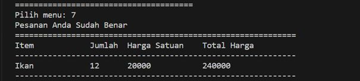

# Python Project: Self Cashier

### A. Latar Belakang
Dengan meningkatnya penggunaan teknologi dalam industri retail dan industri, banyak toko dan supermarket mengadopsi sistem self-checkout untuk menggantikan kasir tradisional. Namun, terdapat tantangan dalam mengimplementasikan Self Cashier. Salah satunya adalah kemampuan sistem untuk mendeteksi, menghitung, dan memverifikasi item yang dibeli oleh pelanggan dengan akurat dan efisien. Dalam beberapa kasus, terjadi kesalahan penghitungan atau kecurangan yang dapat merugikan toko. Untuk mengatasi masalah tersebut, dikembangkanlah program Self Cashier agar dapat dikembangkan untuk mendeteksi item, menghitung total belanjaan, memproses pembayaran, dan menghasilkan tanda bukti transaksi, sehingga dapat membantu meningkatkan efisiensi operasional toko dan memberikan pengalaman berbelanja yang lebih baik bagi pelanggan.


### B. Penjelasan Requirements/Objectives
1. Inisialisasi objek transaksi dengan atribut item.
3. Fungsi untuk menambahkan item ke dalam list items.
4. Fungsi untuk mengganti nama item pada list items.
5. Fungsi untuk mengganti jumlah item pada list items.
6. Fungsi untuk mengganti harga item pada list items.
7. Fungsi untuk menghapus item dari list items.
8. Fungsi untuk menghapus semua item dari list items.
9. Fungsi untuk mengecek apakah input data sudah benar atau tidak.
10. Fungsi untuk menampilkan nama item, jumlah item, harga satuan dan total harga.
11. Fungsi untuk menghitung total harga dari seluruh item pada list items dan menghitung diskon dengan ketentuan yang telah ditetapkan sebelumnya.
12. Mengimport class Transaction
13. Membuat sebuah objek dari `class Transaction()`.
14. Membuat menu utama yang akan dijalankan pertama kali

### C. Penjelasan Alur Code/Flowchart


### D. Penjelasan Functions/Attribute
1. Inisialisasi objek transaksi dengan atribut items, yaitu list kosong untuk menyimpan item-item yang akan dibeli.
```bash
def __init__(self):
  self.items = []
```
2. Fungsi untuk menambahkan item ke dalam list items.
```bash
def add_item(self, item):
  self.items.append(item)
  print("-" * 60)
  print(f"{item} telah berhasil ditambahkan ke keranjang")
  self.show_items()
```
3. Fungsi untuk mengganti nama item pada list items.
```bash
def update_item_name(self, old_name, new_name):
  for item in self.items:
    if item[0] == old_name:
      item[0] = new_name
  print(f"Item {old_name} telah berhasil diubah menjadi {new_name} ")
  self.show_items()
```
4. Fungsi untuk mengganti jumlah item pada list items.
```bash
def update_item_qty(self, name, qty):
  for item in self.items:
    if item[0] == name:
      item[1] = qty
  print(f"Jumlah {name} telah diubah menjadi {qty} ")
  self.show_items()
```
5. Fungsi untuk mengganti harga item pada list items.
```bash
def update_item_price(self, name, price):
  for item in self.items:
    if item[0] == name:
      item[2] = price
  print(f"Harga {name} telah diubah menjadi {price} ")
  self.show_items()
```
6. Fungsi untuk menghapus item dari list items.
```bash
def delete_item(self, name):
  for item in self.items:
    if item[0] == name:
      self.items.remove(item)
  print(f"Anda telah menghapus : {name} ")
  self.show_items()
```
7. Fungsi untuk menghapus semua item dari list items.
```bash
def reset_transaction(self):
  self.items = []
  print(f"Anda telah mereset transaksi ini. Semua item telah dihapus.")
```
8. Fungsi untuk mengecek apakah input data sudah benar atau tidak.
```bash
def check_order(self):
  error = False
  for item in self.items:
    if (None, "", 0) in item or not all(item):
      error = True
    if error:
      print("Terdapat kesalahan input data")
    else:
      print("Pesanan Anda Sudah Benar")
      self.show_items()
```
9. Fungsi untuk menampilkan nama item, jumlah item, harga satuan dan total harga.
```bash
def show_items(self):
  print("=" * 60)
  print("Item\t\tJumlah\tHarga Satuan\tTotal Harga")
  print("-" * 60)
    for item in self.items:
      total_price = item[1] * item[2]
      print("{}\t\t{}\t{}\t\t{}".format(item[0], item[1], item[2], total_price))
    print("-" * 60)
```
10. Fungsi untuk menghitung total harga dari seluruh item pada list items dan menghitung diskon dengan ketentuan yang telah ditetapkan sebelumnya.
```bash
def total_price(self):
  total = 0
  for item in self.items:
    total += item[1] * item[2]
  if total > 500000:
    discount = total * 0.1
  elif total > 300000:
    discount = total * 0.08
  elif total > 200000:
    discount = total * 0.05
  else:
    discount = 0
  total -= discount
  print("Total Harga: {}\nDiskon: {}\nTotal yang harus dibayar: {}".format(total + discount, discount, total))
```
11. Mengimport class Transaction
```bash
from transaction import Transaction
```
12. Membuat sebuah objek dari `class Transaction()`.
```bash
transct_123 = Transaction()
```
13. Membuat menu utama yang akan dijalankan pertama kali.
```bash
def show_items(self):
  print("=" * 60)
  print("Item\t\tJumlah\tHarga Satuan\tTotal Harga")
  print("-" * 60)
    for item in self.items:
        total_price = item[1] * item[2]
            print("{}\t\t{}\t{}\t\t{}".format(item[0], item[1], item[2], total_price))
        print("-" * 60)
```

### E. Demonstrasi Code
1. Test Case 1: Menu tambahkan item

2. Test Case 2: Menu update nama item

3. Test Case 3: Menu update jumlah item

4. Test Case 4: Menu update harga item

5. Test Case 5: Menu hapus item

6. Test Case 6: Menu reset transaksi

7. Test Case 7: Menu cek orderan

8. Test Case 8: Menu selesai menggunakan self cashier


### F. Kesimpulan
Dapat disimpulkan bahwa menggunakan program Self Cashier membuat lebih akurat dan efisien dalam mengimplementasikan sistem self cashier dalam industri retail dan industri. Dengan menggunakan program Self Cashier, pemilik toko atau pengusaha kecil dapat mengembangkan sistem self cashier mereka sendiri dengan mudah untuk mendeteksi item, menghitung total belanjaan, memproses pembayaran, dan menghasilkan tanda bukti transaksi, sehingga dapat membantu meningkatkan efisiensi operasional, mengurangi biaya overhead, serta kemudahan penggunaannya dapat memberikan pengalaman yang lebih baik bagi pelanggan dalam melakukan pembelian.
